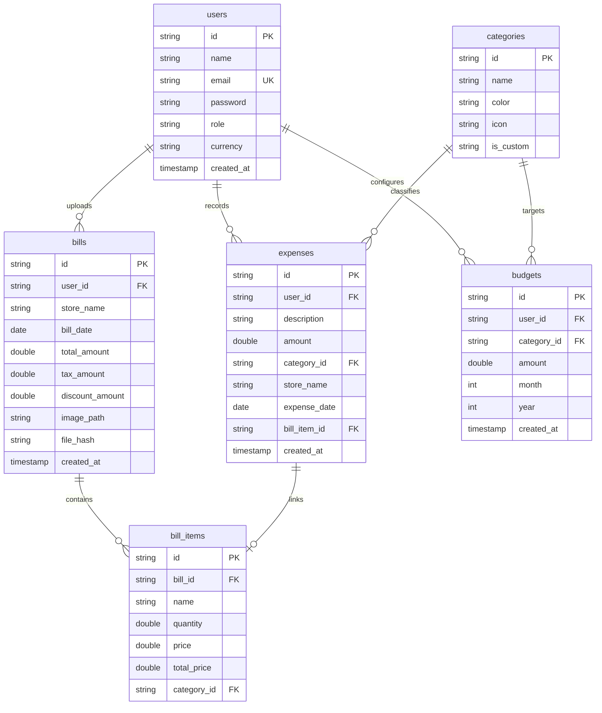

# 🥬 GrocerySmart — AI-Powered Receipt Scanner & Expense Tracker

GrocerySmart is a highly-optimized, enterprise-grade full-stack personal finance application. It enables users to scan local store receipts (via dynamic dual OCR engines), extract specific line-items automatically, classify them using intelligent heuristics/OpenAI classification models, set budget guidelines, and track comprehensive visual analytics.

Built with a modern **React (Vite) + Node.js (Express) + SQLite** stack, the project has been fully refactored into a modular **Controller-Service** architecture with premium features like dark glassmorphic styling, resilient error boundaries, and cloud-ready integrations.

---

## 🚀 Key Highlights & Premium Features

* **🧠 Intelligent Dual-Engine OCR System**: Parses complex receipt text. Dynamically utilizes **Google Cloud Vision OCR** in production for high fidelity and falls back to offline **Tesseract.js** in local development automatically.
* **📦 Barcode Lookup Integration**: Live product lookup using the official **Open Food Facts API** with smart offline mocking dictionaries for seamless local developer testing.
* **🏷️ Hybrid AI Categorization**: Leverages high-speed heuristics for immediate classification, cascading to **OpenAI GPT-3.5** to categorize unique items dynamically.
* **📊 Glassmorphic Dashboard & Analytics**: High-fidelity charts (Weekly outlay curves, category proportions, top purchased items) styled with advanced dark glassmorphism.
* **📅 Budget Threshold Guards**: Real-time monthly spend trackers against categories with automated breach alerts when limits are crossed.
* **🔐 Production Security Policies**: Hardened with signed JWT state managers, salted passwords (`bcryptjs`), CORS origins, Express rate-limit gates, and `Helmet` HTTP security policies.
* **📥 Multi-Format Reports Export**: Integrated downloads for beautiful ledger exports in both **Excel (via xlsx)** and **PDF formats (via pdfkit)**.
* **🛡️ Enterprise Error Boundaries**: Custom glassmorphic React boundaries that intercept runtime exceptions gracefully, ensuring high uptime.
* **☁️ Optional Cloud Asset Pipeline**: Dynamic cloud uploading using **Cloudinary Storage** for receipt image hosting, falling back to local storage in sandbox mode.

---

## 📁 Repository Structure

The workspace follows a clean, professional separation of concerns, separating the REST API backend from the SPA client framework:

```bash
GrocerySmart/
│
├── client/                     # React (Vite) Single Page Application
│   ├── public/                 # Static public web assets
│   ├── src/
│   │   ├── assets/             # Images, custom SVGs, global vectors
│   │   ├── components/         # Reusable global design components (ErrorBoundary, Navigation)
│   │   ├── context/            # Centralized state hubs (AuthContext, ToastContext)
│   │   ├── hooks/              # Custom hooks (useToast)
│   │   ├── layouts/            # Base structural layouts (AppLayout)
│   │   ├── pages/              # Primary route pages (Dashboard, Scanner, Analytics, Budget)
│   │   ├── services/           # API handlers & central Axios configuration (api.js)
│   │   ├── utils/              # Client-side helper methods
│   │   ├── App.jsx             # SPA React Route Hub
│   │   ├── main.jsx            # Entry point rendering
│   │   └── index.css           # Design system tokens and styling rules
│   ├── package.json            # Client dependencies
│   ├── vite.config.js          # Dev proxies and Vite compiler properties
│   └── .env.example            # Client env templates
│
├── server/                     # Node.js (Express) Rest API
│   ├── config/                 # Configurations (database.js, cloudinary.js, vision.js)
│   ├── controllers/            # Router handler logic (auth, bills, expenses, analytics)
│   ├── middleware/             # Rate-limiters, upload streams, JWT validators
│   ├── models/                 # Database schema models (optional ORM layers)
│   ├── routes/                 # Explicit API Route Endpoints (auth, bills, expenses, analytics)
│   ├── services/               # OCR, Barcode API, AI classification engines
│   ├── uploads/                # Local uploaded receipt storage (sandbox only)
│   ├── package.json            # Backend dependencies
│   ├── server.js               # Primary Express bootstrapper
│   ├── seed.js                 # Automatic db tables seeder
│   └── .env.example            # Server env templates
│
├── .gitignore                  # Exclusion file for secure env, db and uploads
├── docker-compose.yml          # Container configuration (optional)
├── Dockerfile                  # Application deployment blueprint
└── README.md                   # Project documentation
```

---

## 🛢️ Database Schema & Optimization

GrocerySmart uses a high-performance **SQLite (`better-sqlite3`)** instance optimized for production read/write throughput:
* Enabled **Write-Ahead Logging (WAL)** for high concurrency.
* Cascading foreign key deletes on relational items.
* Explicit composite indices on search filters:
  * `idx_expenses_user_date` (`user_id`, `expense_date`)
  * `idx_expenses_category` (`category_id`)
  * `idx_budgets_lookup` (`user_id`, `month`, `year`)



---

## 🔌 API Reference Endpoints

All backend REST API paths require an `Authorization` header containing the JWT token (`Bearer <token>`), with the exception of public authentication endpoints.

### Authentication Endpoints
| HTTP Method | Path | Description | Access |
| :--- | :--- | :--- | :--- |
| `POST` | `/api/auth/register` | Register a new user account | Public |
| `POST` | `/api/auth/login` | Login user and issue JWT token | Public |
| `GET` | `/api/auth/me` | Resolve current active user profile | User |
| `PUT` | `/api/auth/profile` | Update profile settings (currency, password, etc) | User |

### Receipt Scanning Endpoints
| HTTP Method | Path | Description | Access |
| :--- | :--- | :--- | :--- |
| `POST` | `/api/bills/scan` | Upload bill receipt photo to run OCR parsing | User |
| `POST` | `/api/bills/save` | Confirm and commit scanned items to SQLite | User |
| `DELETE` | `/api/bills/:id` | Delete scan receipt and cascade delete all items | User |

### Expense Tracking Endpoints
| HTTP Method | Path | Description | Access |
| :--- | :--- | :--- | :--- |
| `GET` | `/api/expenses` | Paginated query ledger with search/date filters | User |
| `POST` | `/api/expenses` | Create a manual expense entry | User |
| `PUT` | `/api/expenses/:id` | Modify an logged expense entry | User |
| `DELETE` | `/api/expenses/:id` | Delete an logged expense entry | User |
| `GET` | `/api/expenses/export/excel` | Export complete ledger in Excel sheet | User |
| `GET` | `/api/expenses/export/pdf` | Export structured expenditure report PDF | User |

### Budget Planner Endpoints
| HTTP Method | Path | Description | Access |
| :--- | :--- | :--- | :--- |
| `GET` | `/api/budgets` | Get current category limits and real-time spent ratio | User |
| `POST` | `/api/budgets` | Set or update a category budget limit | User |
| `DELETE` | `/api/budgets/:id` | Remove a category budget limit | User |

### Administrative telemetry Endpoints
| HTTP Method | Path | Description | Access |
| :--- | :--- | :--- | :--- |
| `GET` | `/api/admin/metrics` | Retrieve general server telemetry gauges | Admin |
| `GET` | `/api/admin/users` | Retrieve registry of all active accounts | Admin |
| `GET` | `/api/admin/logs` | Fetch system audit and interaction trails | Admin |

---

## 🛠️ Local Setup & Configuration

### Prerequisites
* Node.js v18+
* npm or yarn

### 1. Configure Environment Files

Create `.env` inside `server/`:
```bash
cp server/.env.example server/.env
```
Fill out the keys as documented inside `server/.env.example`.

Create `.env` inside `client/`:
```bash
cp client/.env.example client/.env
```
For local testing, leave `VITE_API_URL` empty to let Vite automatically proxy connections.

### 2. Install and Seed Database

Install dependencies across the client and server:
```bash
# Inside the root GrocerySmart directory:
cd client && npm install
cd ../server && npm install --legacy-peer-deps
```

Run database seeder to establish categories and metrics:
```bash
cd server
npm run seed
```

### 3. Launch Development Servers

Start Express REST backend:
```bash
cd server
npm run dev
```
*(Backend runs on `http://localhost:5000`)*

Start React Frontend SPA:
```bash
cd client
npm run dev
```
*(Frontend dev server boots on `http://localhost:5173`)*

---

## ☁️ Production Deployment Pipelines

### Frontend (e.g. Vercel)
1. Link your `client/` folder.
2. Ensure Build command is `npm run build` and output directory is `dist`.
3. Set the environment variable `VITE_API_URL` to your production backend Render URL (e.g., `https://grocerysmart-api.onrender.com`).

### Backend (e.g. Render)
1. Link your `server/` folder as a Node Web Service.
2. Set Build command to `npm install --legacy-peer-deps` and Start command to `npm start`.
3. Add environment variables:
   * `JWT_SECRET` (Secure key)
   * `CORS_ORIGIN` (`https://your-frontend-domain.vercel.app`)
   * `CLOUDINARY_URL` / Google credentials (if enabling cloud extensions)
